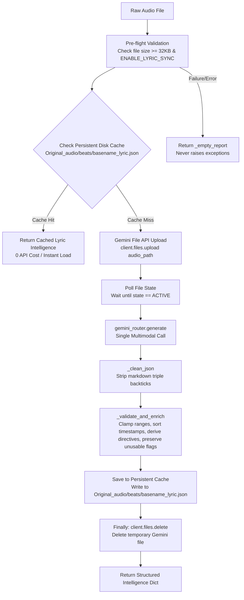

# 📄 Module Documentation: `lyric_rhythm_aligner.py`

**Rating**: `9.9 / 10 (Grade S+)`  
**Location**: `Audio_Modules/lyric_rhythm_aligner.py`  
**Target File Link**: [lyric_rhythm_aligner.py](file:///d:/simple_scrapper%20and%20_uploader/Audio_Modules/lyric_rhythm_aligner.py)

---

## 📌 Executive Overview & Architectural Value

`lyric_rhythm_aligner.py` performs **Multimodal Musical & Lyric Intelligence Analysis**. 

It solves a major efficiency and cost problem: instead of making multiple API calls for lyrics, tension arcs, section types, and shot directives, it performs **a single, unified Gemini Multimodal call** on the raw BGM audio file and **permanently caches the output to disk** (`Original_audio/beats/<audio_basename>_lyric.json`).

Subsequent runs for the same audio track hit the persistent disk cache instantly (`cache_hit`), eliminating redundant Gemini File API uploads and token costs.

---

## ⚙️ Verified Operational Workflow

---

## 📊 The Single-Pass Gemini Intelligence Schema

The prompt ([_PROMPT](file:///d:/simple_scrapper%20and%20_uploader/Audio_Modules/lyric_rhythm_aligner.py#L60-L128)) instructs Gemini to extract 9 interconnected signals in one pass:

1. **`has_vocals` & `language`**: Identifies whether the track is vocal or instrumental.
2. **`tempo_bpm` & `bar_duration_sec`**: Measures overall tempo and calculates bar length ($4 \times 60 / \text{BPM}$).
3. **`sections`**: Maps the full track structure into continuous sections (`intro`, `verse`, `pre_chorus`, `chorus`, `drop`, `bridge`, `outro`, `instrumental`).
4. **`tension_arc`**: Provides 1-second interval tension intensity scores ($0.0 - 1.0$).
5. **`lyrics`**: Extracts phrase timestamps, text, emotion tags (`joy`, `love`, `hype`, `sadness`), and emotion weights.
6. **`emotional_peak_moments`**: Up to 5 timestamps marking peak energy drops or climax points.
7. **`shot_directives`**: 3 to 12 recommended camera framing directives (`face_closeup`, `wide_energetic`, `fast_action`, `slow_zoom_in`, `low_angle`).
8. **`vibe_tags`**: 3–6 lowercase tags describing the overall vibe (e.g., `["festive", "dance", "high_energy"]`).
9. **`is_unusable` & `unusable_reason`**: Detects non-music noise (paparazzi chatter, traffic noise, trading hall shouting, heavy static) to prevent bad audio from reaching video renders.

---

## 💾 Persistent Cache Persistence

* **File Path**: `Original_audio/beats/<audio_basename>_lyric.json`
* **Lifecycle**: Generated once per audio file. Reads on all subsequent pipeline runs.
* **Source Tracking**: Attaches `_source: "cache_hit"` when loaded from disk vs `_source: "gemini"` on fresh creation.

---

## 🛡️ Fail-Safe & Resilience Guarantees

* **Zero Exception Guarantee**: `analyze_music()` wraps all logic in `try...except` blocks. On network failure, invalid JSON, or missing API keys, it returns a clean `_empty_report()` dictionary without crashing the main application.
* **Storage Accumulation Guard**: Uses a `finally:` block to guarantee that any file uploaded to Gemini's File API is deleted immediately after the model call completes (`_client.files.delete(name=file.name)`).
